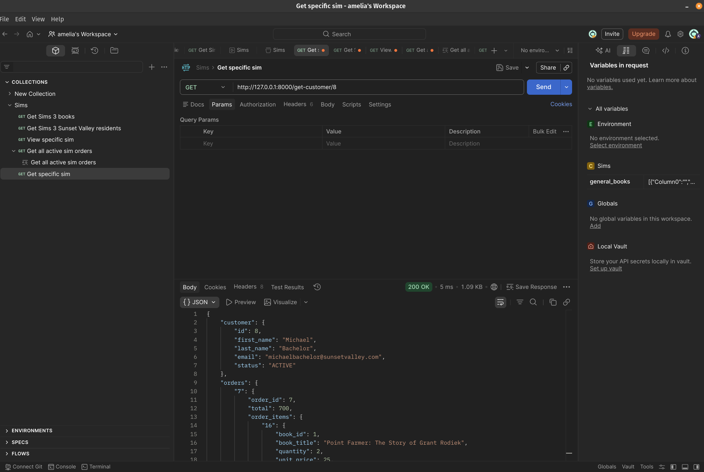
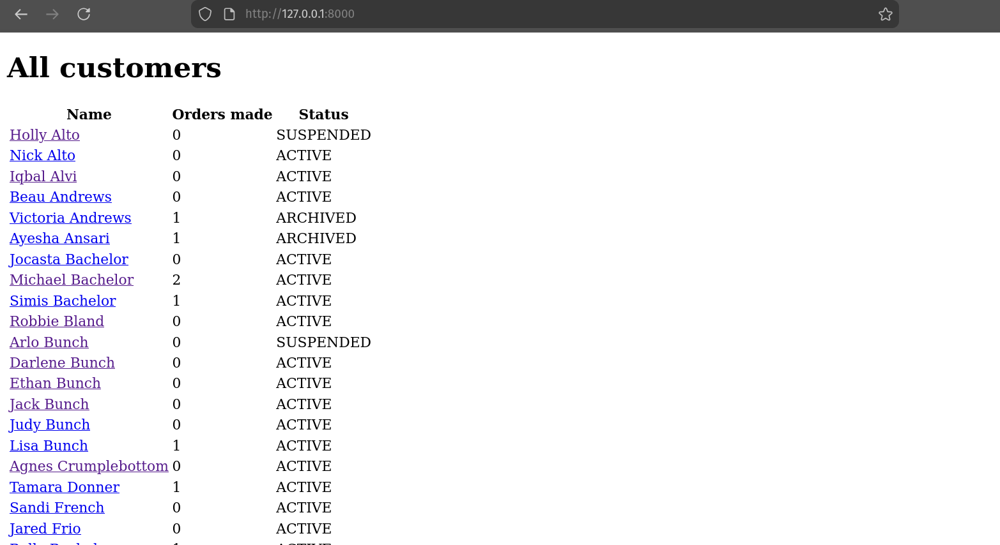
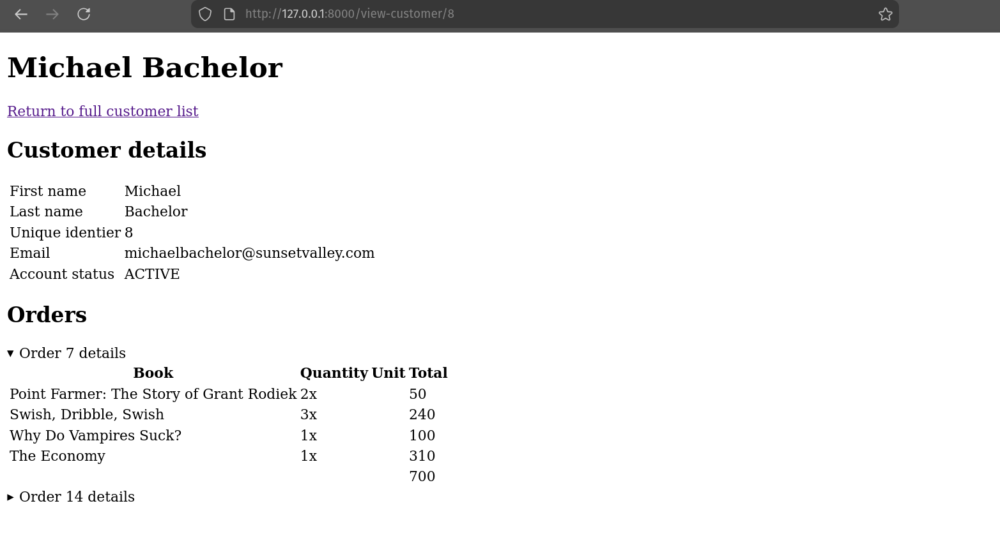
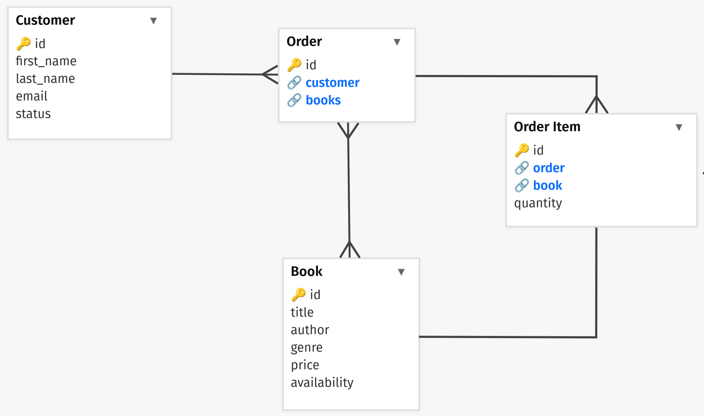

# Sunset Valley Bookshop

## Using the Application
### Set-up Instructions 

1. Clone this repository and `cd` into the project root
2. Create and activate a virtual environment
    
    This is system specific but in Linux would be
    ```
    python3 -m venv .venv
    source .venv/bin/activate
    ```
3. Install the Django and Faker dependencies using
    ```
    pip install -r requirements.txt
    ```
4. Run the application using
    ```
    python3 manage.py runserver
    ```
    The terminal will tell you where the server is located, which is likely `http://127.0.0.1:8000/`


The cloned repo includes all required data, but further orders can be generated using

```
python3 create_orders.py
```

If the database is flushed the `books.json` and `customers.json` fixtures can be installed using
```
python3 manage.py loaddata books.json customers.json
```

Database schema should be created already but if not then run
```
python3 manage.py migrate
```

### Using API to access customer data

#### Choosing a customer ID
If you're using the cloned repo as is then the `customer_id` of `8` should be suitable.

The way order data is generated means not all customers have associated order data. If during application usage ID `8` doesn't work (such as the database being flushed and remade) then do either of the following:
- Access the development server's front-end application: here the landing page includes each customer's orders made which can be used to find a suitable customer ID.
- Alternatively the database can be read in various ways: I have the SQLite Viewer extension so could find a suitable `customer_id` by choosing one from the `bookshop_order` table.

#### Querying the `get-customer` endpoint 
Appending the server url with `/get-customer/<customer_id>` will return a JSON data response

This can be done in a browser or by using a tool like Postman to query the endpoint

<div align="center">
  
</div>

#### Using the front-end to render `/view-customer/<customer_id>`
Visiting the server's landing page will display all customers. Click on any name which will direct you to customer details page.

<div align="center">
  
</div>
<div align="center">
  
</div>

### Using the ETL script

Run the script using
```
python3 order_data_as_csv
```

## Choices and Reasoning

### Technologies Used

SQLite Database:
- Data typing and validation
- Allow querying
- Came automatically configured Django

Django Framework:
- Includes a SQLite database pre-configured
- Designed with its Model-View-Template architecture which suits API request handling
- Built with Object Relational Mapping for configuring data models and their relationships
- Its `manage.py` command-line management tool allows straightforward management of data
    - Performing data migrations
    - Updating database schema
    - Loading fixture data

Faker Library:
- In order to generate orders from the pool of pre-existing customer and book data
- Works well in Django projects  

### Database Design
<div align="center">
  
</div>

I conceptualised an order being a summary of all included products - in this case being books. The database would then need to have the ability to account for the quantity of each book in its order, so a join table was defined which would store this additional information.

The following relationships exist:
- Customer to Order
    - one-to-many
    - A customer should be able to have multiple orders
- Order to Book
    - many-to-many
    - An order should be able to have multiple books
    - A book should be able to exist in multiple orders
- Order to OrderItem
    - one-to-many
    - An order should consist of one or more order items (i.e. each book and its quantity)
- Book to OrderItem
    - one-to-one
    - A book should only correspond to one order item

When an Order or Order Item is deleted, then any related records will reflect that. However Book and Customer deletion is not allowed if any related database references them: instead their respective availability and status fields should be used to prevent new records being made, whilst preserving those that already exist.

### Other Considerations
- Data 
    - It seemed simpler to scrape existing data for Customer and Book, so I scraped [The Sims Wiki](https://sims.fandom.com/wiki/The_Sims_3) for data on Sunset Valley residents and books to buy
    - These would be loaded ahead of using the `create_orders.py` script to create Order and OrderItem data

- Providing data
    - When using the API to request customer data a JSON payload was built so that the data would be more intuitive to use
        - Using Django's inbuilt serialiser on Order data would produce entries per order item
        - This could then be used to set an order total that the frontend could use
    - The ETL script outputs a single CSV based on transformed Order data. It made sense to structure it this way due to the one-to-many relationship between customers and orders
- Solution approach
    - Class based views to enable code reuse and future scalability
    - Inclusion of a front-end to provide a convenient way to access the customer data

## Application Flow

1. Fixtures at `bookshop/fixtures` contain pre-made serialised Book and Customer data
2. Using `manage.py` to `loaddata` on both fixtures installs the data into the database according to their specified models.
3. Then using `create_orders.py` will create Order and Order Item entries in the database.
4. Data can then be queried through the API or directly
    - Querying the customer endpoints is handled by a corresponding Django view, which queries the database, constructs a response to be returned.
        - The `get-customer` endpoint provides the data as JSON
        - The `view-customer` endpoint returns a webpage with the data rendered as HTML
    - Using the export script does not query API. Django is used to access the database using its ORM (Object Relational Mapping) and bootstrap settings. Here the database is queried directly and then results are written to each CSV row as specified. Transformation of data occurs during the writing to the CSV.

## Improvements and ideas
- Adding a test suite to ensure models and views behave as expected.
- Further API logic so dynamic queries can be made.
- Implementing containerisation since I'm concerned about successfully running this on different systems.
- Nicer front-end with ability to filters and sort data.
- Streamlining the database setup by adding loading of fixture data into the `create_orders.py` script.