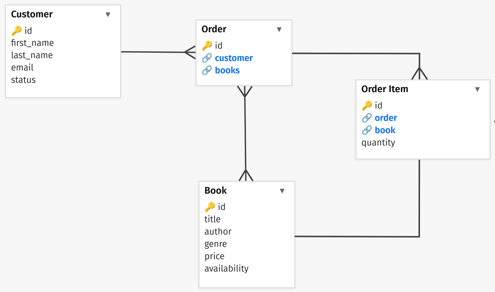

# Sunset Valley Bookshop

## Database Design

  

I conceptualised an order being a summary of all included products - in this case being books. The database would then need to have the ability to account for the quantity of each book in its order, so a join table was defined which would store this additional information.

The following relationships exist:
- Customer to Order
    - one-to-many
    - A customer should be able to have multiple orders
- Order to Book
    - many-to-many
    - An order should be able to have multiple books
    - A book should be able to exist in multiple orders
- Order to OrderItem
    - one-to-many
    - An order should consist of one or more order items (i.e. each book and its quantity)
- Book to OrderItem
    - one-to-one
    - A book should only correspond to one order item

When an Order or Order Item is deleted, then any related records will reflect that. However Book and Customer deletion is not allowed if any related database references them: instead their respective availability and status fields should be used to prevent new records being made, whilst preserving those that already exist.
